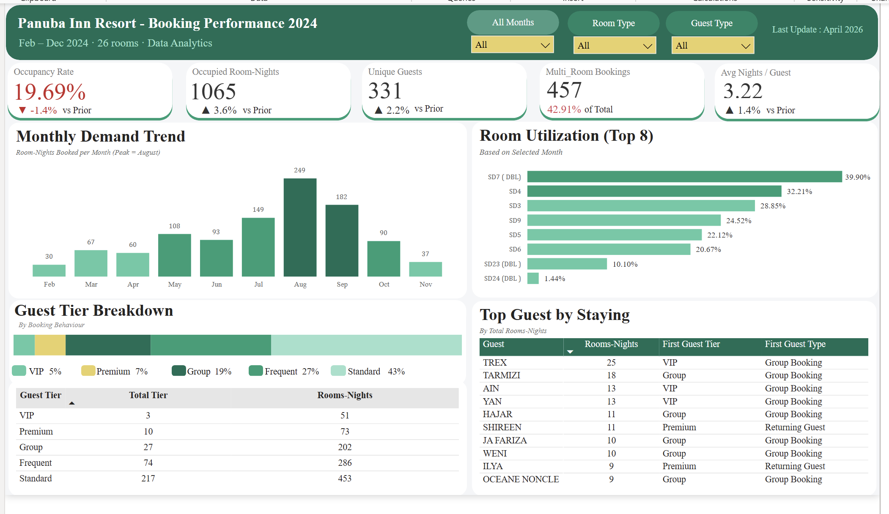

## Resort-Booking-Performance-Analyst
Real-world Power BI dashboard analyzing resort bookings, occupancy trends, room utilization, guest segmentation, and demand performance.

## Dashboard Preview

## Project Objective
This project was built to transform raw booking records into an interactive management dashboard that helps stakeholders monitor resort performance and make better business decisions.

## Key Metrics
- Occupancy Rate
- Occupied Room-Nights
- Unique Guests
- Multi-Room Bookings %
- Average Nights per Guest

## Key Insights
- Peak booking month was August
- Standard tier guests formed the largest segment
- Some rooms had significantly higher utilization than others
- Group bookings generated strong room-night volume
- Guest segmentation helps identify repeat and premium customers

## Dashboard Features
- Dynamic filters by Month, Room Type, Guest Type
- Previous period KPI comparison
- Top guest analysis by stay duration
- Room utilization ranking
- Guest tier breakdown

## Tools Used
- Power BI
- Power Query
- DAX
- Data Cleaning
- Data Modeling
- Dashboard Design

## Business value
This dashboard can help resort managers optimize pricing, room allocation, marketing campaigns, and guest retention strategies.

## Files Included
- Dashboard Screenshot
- README.md
- Dataset.xlsx
- PBIX available upon request

## Author
Fasha Zunin
Data & Business Analyst

